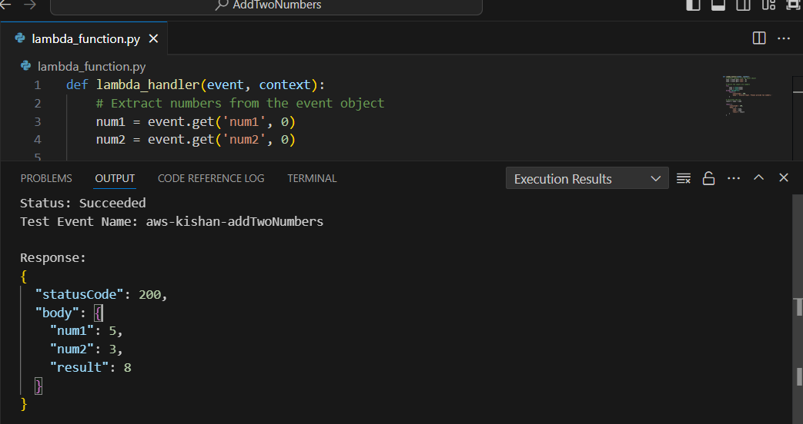
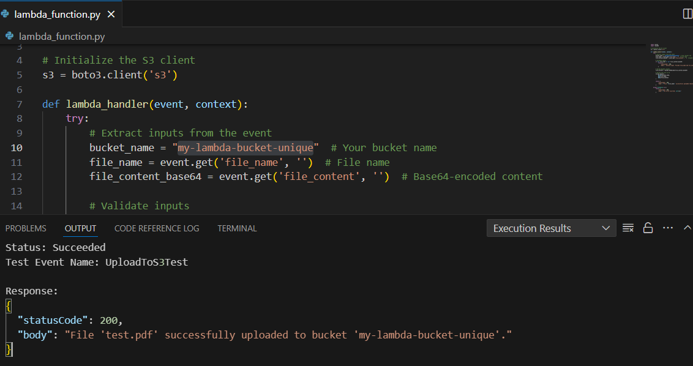
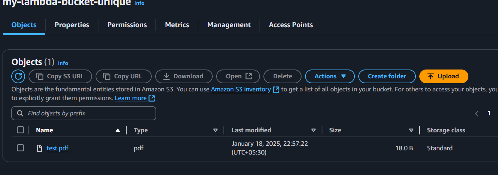

## AWS Lambda Functions

### Function 1: Add Two Numbers
- **File**: `add_two_numbers.py`
- **Description**: This function takes two numbers as input (via an API Gateway) and returns their sum.
- **Deployment Instructions**:
  1. Create a Lambda function in the AWS Management Console.
  2. Upload the `add_two_numbers.py` file as a ZIP.
  3. Test the function using an API Gateway.

### Function 2: Store Document in S3
- **File**: `store_document_s3.py`
- **Description**: This function uploads a document to an S3 bucket.
- **Deployment Instructions**:
  1. Create an S3 bucket in AWS.
  2. Create a Lambda function in the AWS Management Console.
  3. Upload the `store_document_s3.py` file as a ZIP.
  4. Test the function by passing a sample file.

### Example Payloads
For Function 1:
```json
{
  "number1": 5,
  "number2": 10
}

For Function 2:
{
  "bucket_name": "my-lambda-bucket-unique",
  "file_name": "test.pdf",
  "file_content": "content.."
}

## AWS Lambda Output Screenshots

Here are the screenshots of the Lambda function output:

### Add Two Numbers Function


### Store Document in S3 Function



